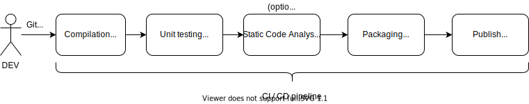

# App Development

## Recommended technology stack
* Springboot / Java 11 or later, as base framework for microservices.
* Testing - all tests must be executable on developer's PC.
  * Junit 5 / TestNG for unit testing.
  * testcontainers for junit / integration testing.
* Docker as application binary delivery.
  * Injectable external configuration, env. variables, mountable application.yml

## Docker image
Final product of microservice is docker image. Docker image is immutable, 
versioned and does not contain any hard-coded configuration.
Configuration of docker image is done using:
* environment variables set when docker is 
* mounting of config files
* mounting data volumes
