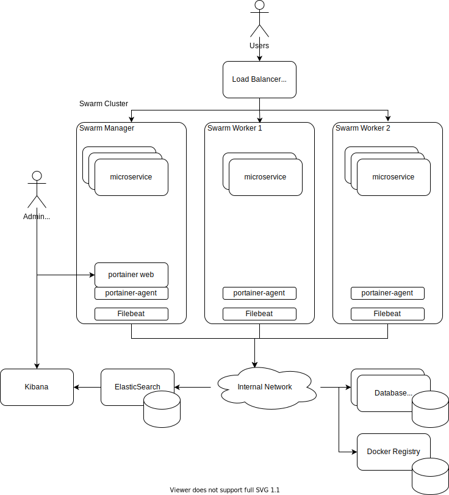

# Docker Swarm deployments



## Swarm container monitoring
* Deploy [portainer.io](https://www.portainer.io/) stack for better cluster visibility.
  ```
  curl -L https://downloads.portainer.io/portainer-agent-stack.yml -o portainer-agent-stack.yml
  docker stack deploy -c portainer-agent-stack.yml portainer
  ``` 

## Start ElasticSearch - Kibana stack
Use [this](https://github.com/jveverka/guildelines-and-procedures/tree/master/docker/elastic-monitoring-stack) docker-compose stack
to start ElasticSearch - Kibana stack.

## Log Collection 
* Create customized Filebeat docker image
  ```
  docker build -t jurajveverka/filebeat:1.0.0-SNAPSHOT --file ./filebeat/Dockerfile ./filebeat
  docker push jurajveverka/filebeat:1.0.0-SNAPSHOT
  ```
* Deploy customized Filebeat as stack on docker swarm cluster.
  ```
  docker stack deploy -c filebeat/filebeat-docker-compose.yml filebeat
  ``` 
* All dockerized microservices are writing logs into stdout.
* containers -> /var/lib/docker/containers/*/*.log -> filebeat -> elasticsearch
* Log rotation on each swarm  node part of local docker daemon setup. 
  * Navigate to the /etc/docker/daemon.json path.
  * Set the parameter log-driver with the name of logging driver. By default, log-driver is set to json-file.
    For example, "log-driver": "json-file"
  * To configure maximum size of logs and number of log files use the key log-opts in daemon.json:
    "log-driver": "json-file", "log-opts": { "max-size": "10m", "max-file": "3" }

## Metrics Collection

### References
* [Metricbeat OS  Data into ES](https://www.baeldung.com/ops/os-data-into-elastic-stack)
* [Beats](https://www.elastic.co/beats/)
* [Structured Logging](https://www.innoq.com/en/blog/structured-logging/)
* [Monitor Docker Swarm and Other Logs](https://dzone.com/articles/centralize-logging-with-docker-swarm-logstash-and)
* [Filebeat](https://www.elastic.co/guide/en/beats/filebeat/current/index.html)
  * [Docker input](https://www.elastic.co/guide/en/beats/filebeat/current/filebeat-input-docker.html)
  * [Add Docker metadata](https://www.elastic.co/guide/en/beats/filebeat/current/add-docker-metadata.html)
* [Metricbeat](https://www.elastic.co/guide/en/beats/metricbeat/current/index.html)
